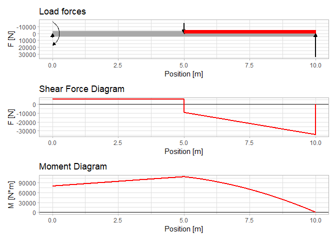

# rstatics

## Overview

*rstatics* package provides functions for the course MAS142 Statics and
Mechanics of Materials at HVL.

## Installation

``` r

if (!require("remotes")) install.packages("remotes")
remotes::install_github("hau-mech/rstatics")
```

## Usage

### Shear and moment diagrams

``` r

library(rstatics)
library(tidyverse)
library(patchwork)

# Problem definition
beam_length = 10

distributed_load <- tibble::tibble(x = seq(5, beam_length, 0.001)) |>
  mutate(load = -5000)

point_force <- tibble::tribble( ~x, ~force,
                                0,   5750,
                                5,  -15000,
                                10,  34250)

point_moment <- tibble::tribble( ~x, ~moment,
                                  0,  -80000)

# Diagrams
plot_internal_forces(.beam_length = beam_length,
                     .point_force = point_force,
                     .point_moment = point_moment, 
                     .distributed_load = distributed_load)
```



